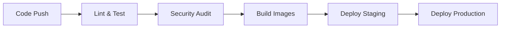

# AI HRMS - System Architecture

## Overview

The AI HRMS (Human Resource Management System) is a modern, scalable enterprise application built with industry-standard technologies and best practices. The system follows a microservices-inspired architecture with a clear separation between frontend and backend services.

## Architecture Principles

### 1. **Separation of Concerns**
- Frontend handles presentation logic only
- Backend manages business logic, data persistence, and external integrations
- Clear API boundaries between services

### 2. **Security First**
- Environment variable validation with Zod
- Comprehensive security headers and CSP
- Rate limiting and request sanitization
- Non-root Docker containers
- Secure authentication with JWT

### 3. **Scalability & Performance**
- Redis for caching and session management
- Database connection pooling with Prisma
- Optimized Docker images with multi-stage builds
- CDN-ready static asset optimization
- Nginx for production frontend serving

### 4. **Code Quality**
- TypeScript for type safety
- Comprehensive ESLint and Prettier configurations
- Pre-commit hooks for code quality enforcement
- Automated testing with Jest
- Code coverage reporting

## System Components

### Frontend (React + TypeScript)

```
frontend/
├── src/
│   ├── components/          # Reusable UI components
│   ├── pages/              # Route-based page components
│   ├── stores/             # Zustand state management
│   ├── hooks/              # Custom React hooks
│   ├── services/           # API client services
│   ├── utils/              # Helper functions
│   └── types/              # TypeScript type definitions
├── public/                 # Static assets
└── dist/                   # Build output
```

**Key Technologies:**
- **React 18**: Modern React with concurrent features
- **TypeScript**: Type safety and developer experience
- **Vite**: Fast build tool and development server
- **Zustand**: Lightweight state management
- **React Router**: Client-side routing
- **Tailwind CSS**: Utility-first styling
- **React Hook Form**: Form validation and management

### Backend (Node.js + TypeScript)

```
backend/
├── src/
│   ├── controllers/        # Request handlers
│   ├── services/           # Business logic
│   ├── middleware/         # Express middleware
│   ├── routes/             # API route definitions
│   ├── utils/              # Helper functions
│   ├── types/              # TypeScript type definitions
│   ├── config/             # Configuration files
│   └── test/               # Test utilities
├── prisma/                 # Database schema and migrations
└── dist/                   # Compiled JavaScript
```

**Key Technologies:**
- **Node.js 18**: Runtime environment
- **Express.js**: Web framework
- **TypeScript**: Type safety
- **Prisma**: Database ORM and migrations
- **Redis**: Caching and session storage
- **Socket.io**: Real-time communication
- **OpenAI API**: AI-powered features
- **JWT**: Authentication tokens

## Security Architecture

### 1. **Application Security**
- **Input Validation**: Zod schemas for runtime validation
- **SQL Injection Protection**: Parameterized queries via Prisma
- **XSS Protection**: Content Security Policy headers
- **CSRF Protection**: SameSite cookies and CSRF tokens
- **Rate Limiting**: Express-rate-limit with Redis backend
- **Security Headers**: Helmet.js for security headers

### 2. **Infrastructure Security**
- **Container Security**: Non-root users in Docker containers
- **Secrets Management**: Environment variables with validation
- **Network Security**: Nginx reverse proxy with rate limiting
- **HTTPS Enforcement**: Strict-Transport-Security headers
- **Dependency Scanning**: Automated security audits in CI/CD

### 3. **Authentication & Authorization**
- **JWT Tokens**: Stateless authentication
- **Refresh Tokens**: Secure token renewal
- **Role-Based Access Control**: Granular permissions
- **Password Security**: bcrypt hashing with salt

## Data Architecture

### Database Design (PostgreSQL)

```sql
-- Core entities with relationships
Users (id, email, password_hash, role, created_at, updated_at)
Employees (id, user_id, employee_number, department_id, ...)
Departments (id, name, manager_id, ...)
Attendance (id, employee_id, check_in, check_out, ...)
Leaves (id, employee_id, type, start_date, end_date, status, ...)
Payroll (id, employee_id, base_salary, deductions, ...)
Performance (id, employee_id, review_period, ratings, ...)
```

### Caching Strategy (Redis)

- **Session Storage**: User sessions and JWT blacklist
- **API Response Caching**: Frequently accessed data
- **Rate Limiting**: Request counting per IP/user
- **Real-time Features**: Socket.io adapter for scaling

## Deployment Architecture

### Container Strategy

```dockerfile
# Multi-stage builds for optimization
FROM node:18-alpine AS base
FROM base AS build
FROM nginx:alpine AS production  # Frontend
FROM node:18-alpine AS production  # Backend
```

### Infrastructure as Code

```yaml
# Docker Compose for local development
version: '3.8'
services:
  frontend:
    build: ./frontend
    ports: ["3000:3000"]
  
  backend:
    build: ./backend
    ports: ["3001:3001"]
    depends_on: [postgres, redis]
  
  postgres:
    image: postgres:15
    environment:
      POSTGRES_DB: hrms
  
  redis:
    image: redis:7-alpine
```

### CI/CD Pipeline



## Performance Optimizations

### Frontend Optimizations

1. **Bundle Splitting**: Vite's automatic code splitting
2. **Tree Shaking**: Eliminate unused code
3. **Asset Optimization**: Image compression and lazy loading
4. **CDN Ready**: Static assets with cache headers
5. **Service Workers**: Offline capability (future enhancement)

### Backend Optimizations

1. **Database Indexing**: Strategic indexes on frequently queried columns
2. **Connection Pooling**: Prisma connection pool configuration
3. **Caching**: Redis for session and data caching
4. **Compression**: Gzip compression for API responses
5. **Rate Limiting**: Prevent API abuse

### Infrastructure Optimizations

1. **Multi-stage Docker Builds**: Minimal production images
2. **Health Checks**: Container and application health monitoring
3. **Horizontal Scaling**: Stateless application design
4. **Load Balancing**: Nginx with upstream servers
5. **Monitoring**: Application and infrastructure metrics

## Monitoring & Observability

### Application Monitoring

- **Error Tracking**: Structured logging with correlation IDs
- **Performance Metrics**: Response times and throughput
- **Health Checks**: Application and dependency health
- **User Analytics**: Usage patterns and feature adoption

### Infrastructure Monitoring

- **Container Metrics**: CPU, memory, and disk usage
- **Database Performance**: Query performance and connection pools
- **Network Monitoring**: Request/response patterns
- **Security Events**: Failed login attempts and rate limiting

## Development Workflow

### Code Quality Gates

1. **Pre-commit Hooks**: Lint and format on commit
2. **Pull Request Checks**: Automated testing and linting
3. **Code Coverage**: Minimum coverage thresholds
4. **Security Scanning**: Dependency and code analysis
5. **Performance Testing**: Load testing for critical paths

### Environment Strategy

- **Development**: Local Docker Compose setup
- **Staging**: Mirror of production for testing
- **Production**: Optimized for performance and security

## Future Enhancements

### Technical Roadmap

1. **Microservices**: Split monolith into domain services
2. **GraphQL**: Flexible API querying
3. **Event Sourcing**: Audit trail and event-driven architecture
4. **Machine Learning**: Enhanced AI features
5. **Mobile Apps**: React Native or native mobile clients

### Scalability Improvements

1. **Kubernetes**: Container orchestration
2. **Message Queues**: Async processing with Redis/RabbitMQ
3. **Database Sharding**: Horizontal database scaling
4. **CDN Integration**: Global content delivery
5. **Multi-region Deployment**: Geographic distribution